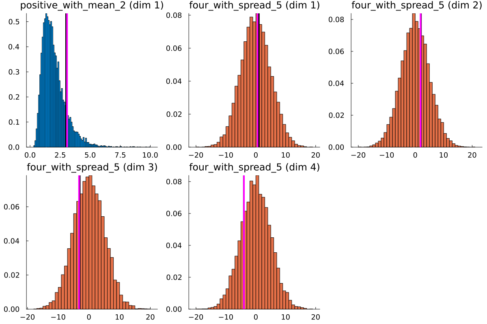

# EnsembleKalmanProcesses.jl
Implements optimization and approximate uncertainty quantification algorithms, Ensemble Kalman Inversion, and other Ensemble Kalman Processes.


| **Documentation**                 | [![dev][docs-latest-img]][docs-latest-url]       |
|-----------------------------------|--------------------------------------------------|
| **DOI**                           | [![DOI][zenodo-img]][zenodo-latest-url]          |
| **Docs Build**                    | [![docs build][docs-bld-img]][docs-bld-url]      |
| **Unit tests**                    | [![unit tests][unit-tests-img]][unit-tests-url]  |
| **Code Coverage**                 | [![codecov][codecov-img]][codecov-url]           |
| **JOSS**                          | [![status][joss-img]][joss-url]                  |
| **Downloads**                     | [![Downloads][dlt-img]][dlt-url]                 |

[zenodo-img]: https://zenodo.org/badge/DOI/10.5281/zenodo.6382967.svg
[zenodo-latest-url]: https://doi.org/10.5281/zenodo.6382967

[docs-latest-img]: https://img.shields.io/badge/docs-latest-blue.svg
[docs-latest-url]: https://CliMA.github.io/EnsembleKalmanProcesses.jl/dev/

[docs-bld-img]: https://github.com/CliMA/EnsembleKalmanProcesses.jl/actions/workflows/Docs.yml/badge.svg
[docs-bld-url]: https://github.com/CliMA/EnsembleKalmanProcesses.jl/actions/workflows/Docs.yml

[unit-tests-img]: https://github.com/CliMA/EnsembleKalmanProcesses.jl/actions/workflows/Tests.yml/badge.svg
[unit-tests-url]: https://github.com/CliMA/EnsembleKalmanProcesses.jl/actions/workflows/Tests.yml

[codecov-img]: https://codecov.io/gh/CliMA/EnsembleKalmanProcesses.jl/branch/main/graph/badge.svg
[codecov-url]: https://codecov.io/gh/CliMA/EnsembleKalmanProcesses.jl

[joss-img]: https://joss.theoj.org/papers/5cb2d4c6af8840af61b44071ae1e672a/status.svg
[joss-url]: https://joss.theoj.org/papers/5cb2d4c6af8840af61b44071ae1e672a

[dlm-img]: https://img.shields.io/badge/dynamic/json?url=http%3A%2F%2Fjuliapkgstats.com%2Fapi%2Fv1%2Fmonthly_downloads%2FEnsembleKalmanProcesses&query=total_requests&suffix=%2Fmonth&label=Downloads
[dlm-url]: https://juliapkgstats.com/pkg/EnsembleKalmanProcesses.c

[dlt-img]: https://img.shields.io/badge/dynamic/json?url=http%3A%2F%2Fjuliapkgstats.com%2Fapi%2Fv1%2Ftotal_downloads%2FEnsembleKalmanProcesses&query=total_requests&label=Downloads
[dlt-url]: https://juliapkgstats.com/pkg/EnsembleKalmanProcesses.c


### Requirements
Julia LTS version or newer

## What does the package do?
EnsembleKalmanProcesses (EKP) enables users to find an (locally-) optimal parameter set `u` for a computer code `G` to fit some (noisy) observational data `y`. It uses a suite of methods from the Ensemble Kalman filtering literature that have a long history of success in the weather forecasting community.

What makes EKP different?
- EKP algorithms are efficient (complexity doesn't strongly scale with number of parameters), and can optimize with noisy and complex parameter-to-data landscapes. 
- We don't require differentiating the model `G` at all! you just need to be able to run it at different parameter configurations.
- We don't even require `G` to be coded up in Julia!
- Ensemble model evaluations are fully parallelizable - so we can exploit our HPC systems capabilities!
- We provide some lego-like interfaces for creating complex priors and observations.
- We provied easy interfaces to toggle between many different algorithms and configurable features.

## What does it look like to use?
Below we will outline the current user experience for using `EnsembleKalmanProcesses.jl`. Copy-paste the snippets to reproduce the results (up to random number generation).

We solve the classic inverse problem where we learn `y = G(u)`, noisy forward map `G` distributed as `N(0,Γ)`. For example, 
```julia
using LinearAlgebra
G(u) = [
    1/abs(u[1]),
    sum(u[2:5]),
    prod(u[3:4]),
    u[1]^2-u[2]-u[3],
    u[4],
    u[5]^3,
    ] .+ 0.1*randn(6)
true_u = [3, 1, 2,-3,-4]
y = G(true_u)
Γ = (0.1)^2*I
```
We assume some prior knowledge of the parameters `u` in the problem (such as approximate scales, and the first parameter being positive), then we are ready to go! 

```julia
using EnsembleKalmanProcesses
using EnsembleKalmanProcesses.ParameterDistributions

prior_u1 = constrained_gaussian("positive_with_mean_2", 2, 1, 0, Inf)
prior_u2 = constrained_gaussian("four_with_spread_5", 0, 5, -Inf, Inf, repeats=4)
prior = combine_distributions([prior_u1, prior_u2]) 

N_ensemble = 50
initial_ensemble = construct_initial_ensemble(prior, N_ensemble)
ensemble_kalman_process = EnsembleKalmanProcess(
    initial_ensemble, y, Γ, Inversion(), verbose=true)

N_iterations = 10
for i in 1:N_iterations
    params_i = get_ϕ_final(prior, ensemble_kalman_process)

    G_matrix = hcat(
        [G(params_i[:, i]) for i in 1:N_ensemble]... # Parallelize here!
    )

    update_ensemble!(ensemble_kalman_process, G_matrix)
end

final_solution = get_ϕ_mean_final(prior, ensemble_kalman_process)


# Let's see what's going on!
using Plots
p = plot(prior)
for (i,sp) in enumerate(p.subplots)
    vline!(sp, [true_u[i]], lc="black", lw=4)
    vline!(sp, [final_solution[i]], lc="magenta", lw=4)
end
display(p)
```


See a similar working example [here!](https://clima.github.io/EnsembleKalmanProcesses.jl/dev/literated/sinusoid_example/). Check out our many example scripts above in `examples/`

# Quick links!

- [How do I build prior distributions?](https://clima.github.io/EnsembleKalmanProcesses.jl/dev/parameter_distributions/)
- [How do I access parameters/outputs from the ekp object](https://clima.github.io/EnsembleKalmanProcesses.jl/dev/troubleshooting/)
- [How do I plot convergence errors or parameter distributions?](https://clima.github.io/EnsembleKalmanProcesses.jl/dev/visualization/)
- [How do I build good observational noise covariances](https://clima.github.io/EnsembleKalmanProcesses.jl/dev/observations/)
- [How do I build my observations and encode batching?](https://clima.github.io/EnsembleKalmanProcesses.jl/dev/observations/)
- [What ensemble size should I take? Which process should I use? What is the recommended configuration?](https://clima.github.io/EnsembleKalmanProcesses.jl/dev/defaults/)
- [What is the difference between `get_u` and `get_ϕ`? Why do the stored parameters apperar to be outside their bounds?](https://clima.github.io/EnsembleKalmanProcesses.jl/dev/parameter_distributions/)
- [What can be parallelized? How do I do it in Julia?](https://clima.github.io/EnsembleKalmanProcesses.jl/dev/parallel_hpc/)
- [What is going on in my own code?](https://clima.github.io/EnsembleKalmanProcesses.jl/dev/troubleshooting/)
- [What is this error/warning/message?](https://clima.github.io/EnsembleKalmanProcesses.jl/dev/troubleshooting/)
- [Where can I walk through a simple example?](https://clima.github.io/EnsembleKalmanProcesses.jl/dev/literated/sinusoid_example/)


## Citing us

If you use the examples or code, please cite [our article at JOSS](https://joss.theoj.org/papers/10.21105/joss.04869) in your published materials.


### Getting Started 

<!---
# Link to Miro for editing photo (ask haakon for access): https://miro.com/app/board/uXjVNm_1teY=/?share_link_id=329380184889  
-->
