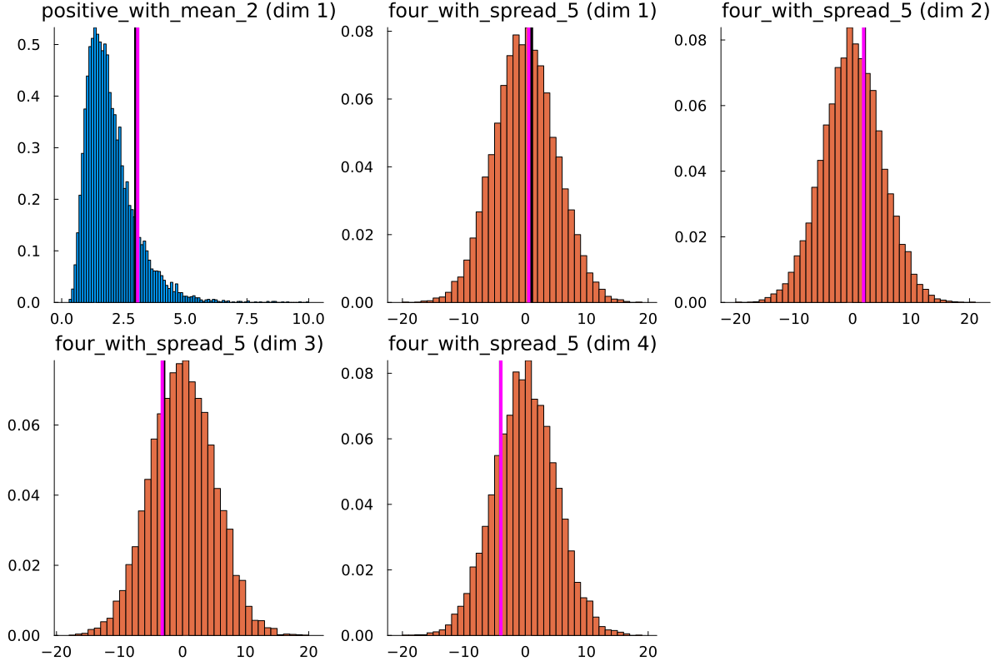

# EnsembleKalmanProcesses.jl

Derivative-free optimization and approximate uncertainty quantification, built on ensemble Kalman methods.

EnsembleKalmanProcesses.jl (EKP) helps you find (locally) optimal parameters `u` for a computer model `G` so that it fits noisy observational data `y`. It implements a suite of methods from the ensemble Kalman filtering literature and works with any model you can run at different parameter values, in Julia or not.

|||
|------------------:|:------------------------------------------------------------|
| **Documentation** | [![stable][docs-stable-img]][docs-stable-url] [![dev][docs-dev-img]][docs-dev-url] |
| **Version**       | [![version][version-img]][version-url]                      |
| **License**       | [![license][license-img]][license-url]                      |
| **Tests**         | [![gha ci][gha-ci-img]][gha-ci-url]                         |
| **Code Coverage** | [![codecov][codecov-img]][codecov-url]                      |
| **Downloads**     | [![Downloads][dlt-img]][dlt-url]                            |
| **DOI**           | [![DOI][zenodo-img]][zenodo-url]                            |
| **JOSS**          | [![status][joss-img]][joss-url]                             |

[docs-stable-img]: https://img.shields.io/badge/docs-stable-blue.svg
[docs-stable-url]: https://CliMA.github.io/EnsembleKalmanProcesses.jl/stable/

[docs-dev-img]: https://img.shields.io/badge/docs-dev-blue.svg
[docs-dev-url]: https://CliMA.github.io/EnsembleKalmanProcesses.jl/dev/

[version-img]: https://juliahub.com/docs/General/EnsembleKalmanProcesses/stable/version.svg
[version-url]: https://juliahub.com/ui/Packages/General/EnsembleKalmanProcesses

[license-img]: https://img.shields.io/badge/license-Apache%202.0-blue.svg
[license-url]: https://github.com/CliMA/EnsembleKalmanProcesses.jl/blob/main/LICENSE

[gha-ci-img]: https://github.com/CliMA/EnsembleKalmanProcesses.jl/actions/workflows/Tests.yml/badge.svg?branch=main
[gha-ci-url]: https://github.com/CliMA/EnsembleKalmanProcesses.jl/actions/workflows/Tests.yml?query=branch%3Amain

[codecov-img]: https://codecov.io/gh/CliMA/EnsembleKalmanProcesses.jl/branch/main/graph/badge.svg
[codecov-url]: https://codecov.io/gh/CliMA/EnsembleKalmanProcesses.jl

[dlt-img]: https://img.shields.io/badge/dynamic/json?url=http%3A%2F%2Fjuliapkgstats.com%2Fapi%2Fv1%2Ftotal_downloads%2FEnsembleKalmanProcesses&query=total_requests&label=Downloads
[dlt-url]: https://juliapkgstats.com/pkg/EnsembleKalmanProcesses

[zenodo-img]: https://zenodo.org/badge/DOI/10.5281/zenodo.6382967.svg
[zenodo-url]: https://doi.org/10.5281/zenodo.6382967

[joss-img]: https://joss.theoj.org/papers/5cb2d4c6af8840af61b44071ae1e672a/status.svg
[joss-url]: https://joss.theoj.org/papers/5cb2d4c6af8840af61b44071ae1e672a

## Features

- **Derivative-free**: no gradients of the forward model `G` are required — you only need to run it at different parameter values.
- **Language-agnostic**: `G` does not need to be written in Julia.
- **Efficient at scale**: computational complexity does not scale strongly with the number of parameters, and the methods tolerate noisy and complex parameter-to-data landscapes.
- **Parallelizable**: ensemble model evaluations are embarrassingly parallel, so you can exploit HPC resources ([parallelism guide](https://clima.github.io/EnsembleKalmanProcesses.jl/dev/parallel_hpc/)).
- **Composable priors and observations**: lego-like interfaces for building complex [parameter distributions](https://clima.github.io/EnsembleKalmanProcesses.jl/dev/parameter_distributions/) and [observations](https://clima.github.io/EnsembleKalmanProcesses.jl/dev/observations/).
- **Many algorithms, one interface**: toggle between ensemble Kalman inversion, sampling, unscented, transform, and Gauss–Newton variants and their configurable features ([recommended configurations](https://clima.github.io/EnsembleKalmanProcesses.jl/dev/defaults/)).

## Installation

EnsembleKalmanProcesses.jl is a registered Julia package, requiring Julia LTS version or newer. Install it with the built-in package manager:

```julia
using Pkg
Pkg.add("EnsembleKalmanProcesses")
```

See the [installation instructions](https://clima.github.io/EnsembleKalmanProcesses.jl/dev/installation_instructions/) for developer setup.

## Quick example

We solve the classic inverse problem of finding parameters `u` from data `y = G(u)`, where the forward map `G` carries additive noise distributed as `N(0, Γ)`. Copy-paste the snippets to reproduce the results (up to random number generation).

```julia
using LinearAlgebra
G(u) = [
    1/abs(u[1]),
    sum(u[2:5]),
    prod(u[3:4]),
    u[1]^2-u[2]-u[3],
    u[4],
    u[5]^3,
    ] .+ 0.1*randn(6)
true_u = [3, 1, 2,-3,-4]
y = G(true_u)
Γ = (0.1)^2*I
```

We assume some prior knowledge of the parameters `u` (such as approximate scales, and the first parameter being positive), then we are ready to go:

```julia
using EnsembleKalmanProcesses
using EnsembleKalmanProcesses.ParameterDistributions

prior_u1 = constrained_gaussian("positive_with_mean_2", 2, 1, 0, Inf)
prior_u2 = constrained_gaussian("four_with_spread_5", 0, 5, -Inf, Inf, repeats=4)
prior = combine_distributions([prior_u1, prior_u2])

N_ensemble = 50
initial_ensemble = construct_initial_ensemble(prior, N_ensemble)
ensemble_kalman_process = EnsembleKalmanProcess(
    initial_ensemble, y, Γ, Inversion(), verbose=true)

N_iterations = 10
for i in 1:N_iterations
    params_i = get_ϕ_final(prior, ensemble_kalman_process)

    G_matrix = hcat(
        [G(params_i[:, j]) for j in 1:N_ensemble]... # Parallelize here!
    )

    update_ensemble!(ensemble_kalman_process, G_matrix)
end

final_solution = get_ϕ_mean_final(prior, ensemble_kalman_process)

# Let's see what's going on!
using Plots
p = plot(prior)
for (i, sp) in enumerate(p.subplots)
    vline!(sp, [true_u[i]], lc="black", lw=4)
    vline!(sp, [final_solution[i]], lc="magenta", lw=4)
end
display(p)
```



For a walkthrough of a similar problem, see the [sinusoid example](https://clima.github.io/EnsembleKalmanProcesses.jl/dev/literated/sinusoid_example/); many more example scripts live in [`examples/`](examples/).

## Documentation

New to the package? This roadmap shows how the pieces fit together:


<!---
# Link to Miro for editing photo (ask haakon for access): https://miro.com/app/board/uXjVNm_1teY=/?share_link_id=329380184889
-->

### Common questions

- [How do I build prior distributions?](https://clima.github.io/EnsembleKalmanProcesses.jl/dev/parameter_distributions/)
- [How do I access parameters/outputs from the ekp object?](https://clima.github.io/EnsembleKalmanProcesses.jl/dev/troubleshooting/)
- [How do I plot convergence errors or parameter distributions?](https://clima.github.io/EnsembleKalmanProcesses.jl/dev/visualization/)
- [How do I build good observational noise covariances?](https://clima.github.io/EnsembleKalmanProcesses.jl/dev/observations/)
- [How do I build my observations and encode batching?](https://clima.github.io/EnsembleKalmanProcesses.jl/dev/observations/)
- [What ensemble size should I take? Which process should I use? What is the recommended configuration?](https://clima.github.io/EnsembleKalmanProcesses.jl/dev/defaults/)
- [What is the difference between `get_u` and `get_ϕ`? Why do the stored parameters appear to be outside their bounds?](https://clima.github.io/EnsembleKalmanProcesses.jl/dev/parameter_distributions/)
- [What can be parallelized? How do I do it in Julia?](https://clima.github.io/EnsembleKalmanProcesses.jl/dev/parallel_hpc/)
- [What is going on in my own code?](https://clima.github.io/EnsembleKalmanProcesses.jl/dev/troubleshooting/)
- [What is this error/warning/message?](https://clima.github.io/EnsembleKalmanProcesses.jl/dev/troubleshooting/)
- [Where can I walk through a simple example?](https://clima.github.io/EnsembleKalmanProcesses.jl/dev/literated/sinusoid_example/)
- [How can Claude Code help maintain or use this package?](#claude-integration)

## Integration with CliMA models

EnsembleKalmanProcesses.jl is a standalone package with no dependence on the rest of the CliMA ecosystem — you can use it to calibrate any model. Within CliMA, [ClimaCalibrate.jl](https://github.com/CliMA/ClimaCalibrate.jl) builds on it to run HPC calibration pipelines for models such as [ClimaAtmos.jl](https://github.com/CliMA/ClimaAtmos.jl) and [ClimaLand.jl](https://github.com/CliMA/ClimaLand.jl).

## Contributing

Contributions are welcome! See the [contributing guide](https://clima.github.io/EnsembleKalmanProcesses.jl/dev/contributing/) for how to open issues and pull requests. Development follows the shared CliMA engineering standards in [CliMA/DeveloperGuides](https://github.com/CliMA/DeveloperGuides).

## Citing us

If you use the examples or code, please cite [our article at JOSS](https://joss.theoj.org/papers/10.21105/joss.04869) in your published materials.

## Claude integration

This repository ships [Claude Code](https://claude.com/claude-code) skills in [`.claude/skills/`](.claude/skills/) that automate common maintenance tasks. If you're developing `EnsembleKalmanProcesses.jl` with Claude Code, these trigger automatically when your prompt matches their purpose — no need to invoke them by name.

### Skills for package developers

| Skill | What it does | Example prompt |
| ------- | --------------- | ----------------- |
| `math-auditor` | Runs an adversarial mathematical-accuracy review of `src/` and `test/`, producing a dated report plus self-contained fix prompts for a follow-up session. | "Review the math in src/ and test/ for correctness — construct an adversarial code review as markdown." |
| `docstrings` | Adds or normalises docstrings on exported symbols so the public API is self-documenting and `Documenter.jl`'s `checkdocs` passes, then syncs the `docs/src/API/` pages. | "Add docstrings to the exported functions in src/Localizers.jl and make sure they show up on the API page." |
| `error-message-manager` | Rewrites vague or low-context Julia error messages (bare `@assert`, generic `ArgumentError`/`DimensionMismatch`, unhelpful `throw`s) into structured, actionable diagnostics. | "The DimensionMismatch error you get from a bad prior/observation size mismatch is really unhelpful — can you improve it?" |
| `base-show` | Adds concise `Base.show`/`Base.summary` methods to Julia types whose default REPL representation is unhelpful or overwhelming. | "The REPL output for `EnsembleKalmanProcess` is way too verbose — can you make it print something more useful?" |

### Skills for package users — coming soon

<!-- coming-soon -->
The following skills are aimed at people *using* `EnsembleKalmanProcesses.jl` in their own projects, not at developers of this package, so they aren't installed automatically in your own repository.

- `slurm-pipeline-manager` — scaffolds and maintains a SLURM/HPC job-dependency tree for an EKP calibration pipeline (forward-model ensemble jobs, aggregation, and update steps wired together with `sbatch` dependencies).

Until these are published as a standalone install, copy the skill folder you want from this repo's [`.claude/skills/`](.claude/skills/) directory into the `.claude/skills/` directory of your own project to use it with Claude Code.
<!-- /coming-soon -->
