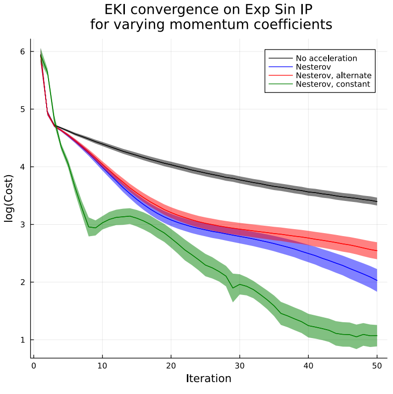
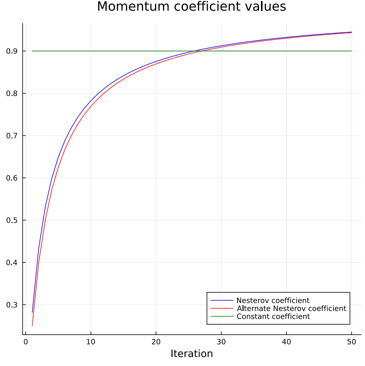
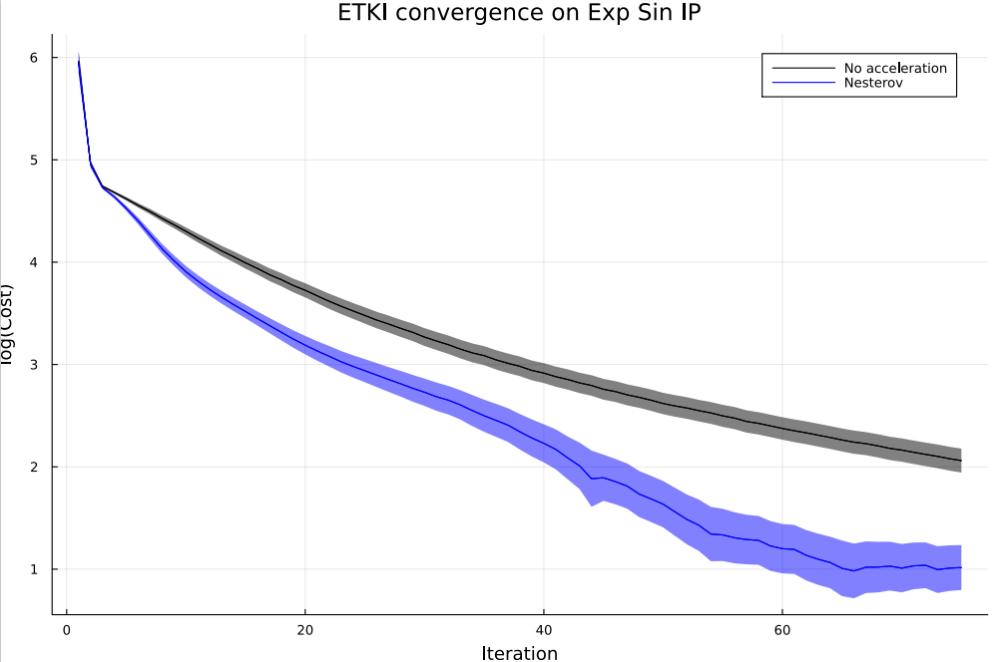

# Accelerators

Here, we introduce the Accelerator structs in `Accelerators.jl`, which have been adapted from gradient-based methods in order to accelerate gradient-free ensemble Kalman processes.

While developed for use with ensemble Kalman inversion (EKI), Accelerators have been shown to accelerate convergence for ensemble transform Kalman inversion (ETKI) as well. They are also implemented for use with unscented Kalman inversion (UKI) and the ensemble Kalman sampler (EKS); however, acceleration is experimental for these methods, and often results in instability.

## "Momentum" Acceleration in Gradient Descent

In traditional gradient descent, one iteratively solves for $x^*$, the minimizer of a function $f(x)$, by performing the update step 

```math
x_{k+1} = x_{k} + \alpha  \nabla f(x_{k}), 
```

where $\alpha$ is a step size parameter.
In 1983, Nesterov's momentum method was introduced to accelerate gradient descent. In the modified algorithm, the update step becomes 

```math
x_{k+1} = x_{k} + \beta (x_{k} - x_{k-1}) + \alpha  \nabla f(x_{k} + \beta (x_{k} - x_{k-1})), 
```

where $\beta$ is a momentum coefficient. Intuitively, the method mimics a ball gaining speed while rolling down a constantly-sloped hill.

## Implementation in Ensemble Kalman Inversion Algorithm

EKI can be understood as an approximation of gradient descent ([Kovachki and Stuart 2019](https://iopscience.iop.org/article/10.1088/1361-6420/ab1c3a)). This fact inspired the implementation of Nesterov momentum-inspired accelerators in the EKP package. For an overview on the algorithm without modification, please see the documentation for Ensemble Kalman Inversion.

The traditional update step for EKI is as follows, with $j = 1, ..., J$ denoting the ensemble member and $k$ denoting iteration number.
```math
u_{k+1}^j = u_{k}^j + \Delta t C_{k}^{u\mathcal{G}} (\frac{1}{\Delta t}\Gamma + C^{\mathcal{G}\mathcal{G}}_k)^{-1} \left(y - \mathcal{G}(u_k^j)\right)
```

When using the ``NesterovAccelerator``, this update step is modified to include a term reminiscent of that in Nesterov's momentum method for gradient descent.

We first compute intermediate values:

```math
v_k^j = u_k^j+ \beta_k (u_k^j - u_{k-1}^j)
```
We then update the ensemble:

```math
u_{k+1}^j = v_{k}^j + \Delta t C_{k}^{u\mathcal{G}} (\frac{1}{\Delta t}\Gamma + C^{\mathcal{G}\mathcal{G}}_k)^{-1} \left(y - \mathcal{G}(v_k^j)\right)
```

The momentum coefficient $\beta_k$ here is recursively computed as $\beta_k = \theta_k(\theta_{k-1}^{-1}-1)$ in the ``NesterovAccelerator``, as derived in ([Su et al](https://jmlr.org/papers/v17/15-084.html)). Alternative accelerators are the ``FirstOrderNesterovAccelerator``, which uses $\beta_k = 1-3k^{-1}$, and the ``ConstantNesterovAccelerator``, which uses a specified constant coefficient, with the default being $\beta_k = 0.9$. The recursive ``NesterovAccelerator`` coefficient has generally been found to be the most effective in most test cases.

## Mathematical Understanding

In practice, these acceleration methods have been found to significantly accelerate convergence on several inverse problems. However, the mathematical reasoning behind this acceleration for EKI is not yet fully understood. A potential avenue for understanding how momentum affects the EKI algorithm is by using gradient flows, as in ([Kovachki and Stuart, 2021](https://jmlr.org/papers/v22/19-466.html)).

## Using Accelerators

An EKI struct can be created with momentum acceleration as follows:

```julia
using EnsembleKalmanProcesses
using EnsembleKalmanProcesses.ParameterDistributions

seed = 1
rng = Random.MersenneTwister(1)

# assume we have defined a prior distribution, a scalar N_ens, a vector of observations y, and observational noise covariance Γ

initial_ensemble = EKP.construct_initial_ensemble(rng, prior, N_ens)

ekiobj_accelerated = EKP.EnsembleKalmanProcess(
            initial_ensemble,
            y,
            Γ,
            Inversion();
            accelerator = NesterovAccelerator()
        )
```
The rest of the process is the same as without the accelerator.

Very similarly, one can create an ETKI struct with acceleration:
```julia
etkiobj_accelerated = EKP.EnsembleKalmanProcess(
            initial_ensemble,
            y,
            Γ,
            TransformInversion();
            accelerator = NesterovAccelerator()
        )
```

Again, the rest of the process is the same as without the accelerator.

## Experiments on EKI and ETKI

Accelerators have been found to accelerate EKI convergence on a number of example inverse problems. In this "exponential sine" inverse problem, we look to solve for amplitude and vertical shift parameters of an underlying sine wave. The model is defined as $\exp\left(\theta_1 \sin(\phi+t) + \theta_2\right)$, with unknown parameters $\theta = [\theta_1, \theta_2]$. Observations (model output) consist of the difference between maximum and minimum, and the mean, of the evaluated model. We define $\theta_\text{true} = \left[1, 0.8\right]$.

The `NesterovAccelerator` (shown in blue) has been found to produce the most consistent acceleration on this problem, as seen below. The `FirstOrderNesterovAccelerator` (shown in red) uses a momentum coefficient very similar to that of the `NesterovAccelerator`, and enjoys similar performance. The `ConstantNesterovAccelerator` (shown in green) is effective in this test case, but can be very unstable. These methods differ only in their momentum coefficient values, which are plotted on the right. Vanilla EKI is shown in black. The experiment is repeated 50 times; ribbons denote one standard error from the mean.

    

Below is an example of accelerated ETKI convergence on the same problem, using the `NesterovAccelerator`.


