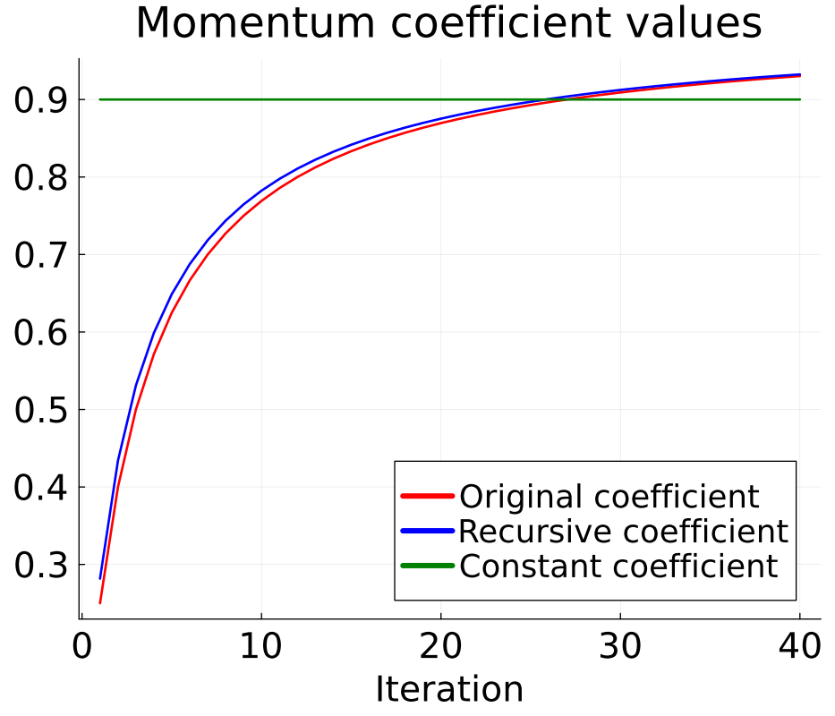
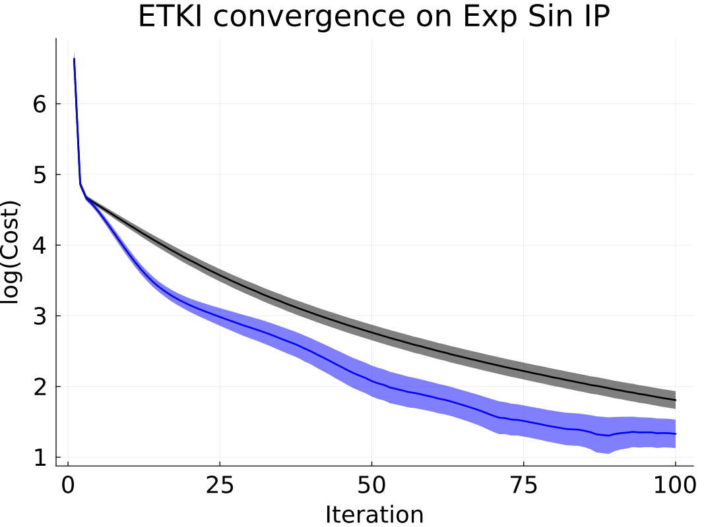

# Accelerators

We provide options to accelerate the convergence of some optimizer variants with [accelerators](https://github.com/CliMA/EnsembleKalmanProcesses.jl/blob/main/src/Accelerators.jl).
These accelerators have been adapted from gradient-based methods in order to accelerate the following ensemble Kalman processes:

- Ensemble Kalman inversion (EKI), `Inversion()`
- Ensemble transform Kalman inversion (ETKI), `TransformInversion()`
- Unscented Kalman inversion (UKI), `Unscented()` (experimental, may result in instability)
- Ensemble Kalman sampler (EKS), `Sampler()` (experimental, may result in instability)

Further theoretical details and experiments of the accelerators, please see [(Vernon, Bach, Dunbar, 2025)](https://doi.org/10.48550/arXiv.2501.08779)

## Using Accelerators

An EKI struct can be created with acceleration as follows:

```julia
# assume we have defined an initial ensemble, a vector of observations y, and observational noise covariance Γ

ekiobj_accelerated = EKP.EnsembleKalmanProcess(
            initial_ensemble,
            y,
            Γ,
            Inversion();
            accelerator = NesterovAccelerator()
        )
```
The rest of the process is the same as without the accelerator.

Very similarly, one can create an ETKI struct with acceleration:
```julia
etkiobj_accelerated = EKP.EnsembleKalmanProcess(
            initial_ensemble,
            y,
            Γ,
            TransformInversion();
            accelerator = NesterovAccelerator()
        )
```

Again, the rest of the process is the same as without the accelerator.

## Experiments on EKI and ETKI

Accelerators have been found to accelerate EKI convergence on a number of example inverse problems. In this "exponential sine" inverse problem, we look to solve for amplitude and vertical shift parameters of an underlying sine wave. The model is defined as $\exp\left(\theta_1 \sin(\phi+t) + \theta_2\right)$, with unknown parameters $\theta = [\theta_1, \theta_2]$. Observations (model output) consist of the difference between maximum and minimum, and the mean, of the evaluated model. We define $\theta_\text{true} = \left[1, 0.8\right]$.

The `NesterovAccelerator()` (shown in blue) has been found to produce the most consistent acceleration on this problem, as seen below. The `FirstOrderNesterovAccelerator()` (shown in red) uses a momentum coefficient very similar to that of the `NesterovAccelerator()`, and enjoys similar performance. The `ConstantNesterovAccelerator(0.9)` (shown in green) is effective in this test case, but can be very unstable. These methods differ only in their momentum coefficient values, which are plotted on the right. Vanilla EKI is shown in black. The experiment is repeated 50 times; ribbons denote one standard error from the mean.




Below is an example of accelerated ETKI convergence on the same problem, using the `NesterovAccelerator()`.

 

## Background & Implementation

### Nesterov Acceleration for Gradient Descent

In traditional gradient descent, one iteratively solves for $x^*$, the minimizer of a function $f(x)$, by performing the update step 

```math
x_{k+1} = x_{k} + \alpha  \nabla f(x_{k}), 
```

where $\alpha$ is a step size parameter.
In 1983, Nesterov acceleration (also known as Nesterov momentum) was introduced to accelerate gradient descent. In the modified algorithm, the update step becomes 

```math
x_{k+1} = x_{k} + \beta (x_{k} - x_{k-1}) + \alpha  \nabla f(x_{k} + \beta (x_{k} - x_{k-1})), 
```

where $\beta$ is a momentum coefficient. Intuitively, the method mimics a ball gaining speed while rolling down a constantly-sloped hill.

### Implementation in EKI Algorithm

The exact implementation, theory, and experiments for this work are available at [(Vernon, Bach, Dunbar, 2025)](https://doi.org/10.48550/arXiv.2501.08779).

Nesterov acceleration can be used to accelerate gradient flows, as shown by [(Su et al 2016)](https://arxiv.org/abs/1503.01243). EKI, a gradient-free method, can be understood as approximating a form of gradient flow [(Calvello et al 2023)](https://arxiv.org/abs/2209.11371)). Additionally, work by [(Kovachki and Stuart 2021)](https://iopscience.iop.org/article/10.1088/1361-6420/ab1c3a) demonstrated success when using a modified particle-based Nesterov acceleration method. This work inspired the following implementation of accelerators for a variety of EKP processes.

The traditional update step for EKI is as follows, with $j = 1, ..., J$ denoting the ensemble member and $k$ denoting iteration number.
```math
u_{k+1}^j = u_{k}^j + C_{k}^{u\mathcal{G}} (\frac{1}{\Delta t}\Gamma + C^{\mathcal{G}\mathcal{G}}_k)^{-1} \left(y - \mathcal{G}(u_k^j)\right)
```

When using accelerators, this update step is modified to include a term reminiscent of that in Nesterov's acceleration method for gradient descent.

We first compute intermediate values:

```math
v_k^j = u_k^j+ \beta_k (u_k^j - u_{k-1}^j)
```
We then update the ensemble:

```math
u_{k+1}^j = v_{k}^j + C_{k}^{u\mathcal{G}} (\frac{1}{\Delta t}\Gamma + C^{\mathcal{G}\mathcal{G}}_k)^{-1} \left(y - \mathcal{G}(v_k^j)\right)
```

The momentum coefficient $\beta_k$ here differs for different accelerators.

- In the `NesterovAccelerator()`, we recursively compute $\beta_k$ as $\beta_k = \theta_k(\theta_{k-1}^{-1}-1)$ in the  as derived in ([Su et al](https://jmlr.org/papers/v17/15-084.html)). This implementation has generally been found to be the most effective in most test cases.
- In the `FirstOrderNesterovAccelerator()`, we compute $\beta_k = 1-3k^{-1}$. This is the coefficient originally used by Nesterov.
- The `ConstantNesterovAccelerator()` uses a specified constant coefficient, with the default being $\beta_k = 0.9$.
