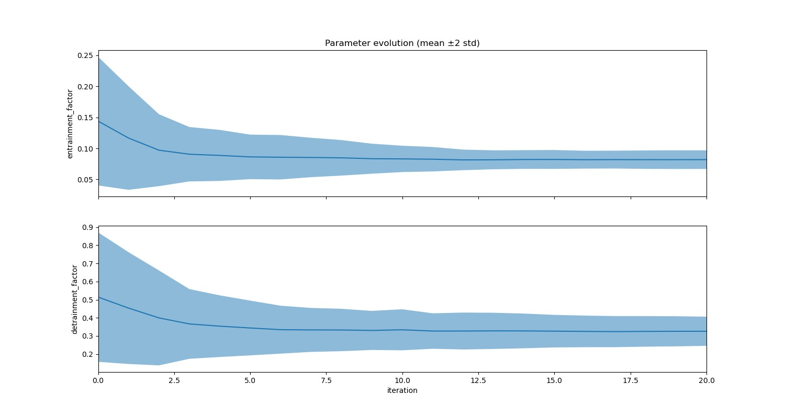
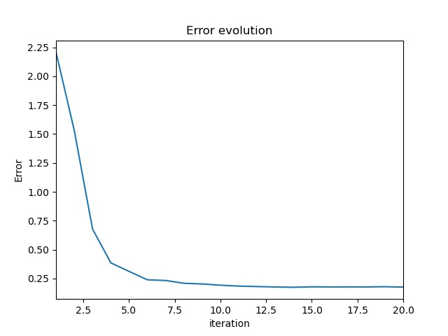

# TurbulenceConvection.jl example


## Overview

`TurbulenceConvection.jl` is a a single-column atmospheric model in Julia. The model implements the extended eddy-diffusivity mass-flux closure for unified representation of subgrid-scale turbulence and convection. In this example, we demonstrate the calibration of parameters for dynamic entrainment and detrainment, which represent key processes for subgrid-scale mixing. Finite time-averaged statistics of grid-mean quantities are obtained from high-resolution Large Eddy Simulations, and are used as reference data in the calibration process.


## Extended eddy-diffusivity mass-flux equations

The extended eddy-diffusivity mass-flux closure is implemented as described in [Lopez-Gomez et al. 2020](https://doi.org/10.1029/2020MS002161) and [Cohen et al. 2020](https://doi.org/10.1029/2020MS002162).

**Equations**

## Prerequisites

In order to run this example, you need to clone the `TurbulenceConvection.jl` repo from GitHub.

  > git clone https://github.com/CliMA/TurbulenceConvection.jl

Then, install the repository into this example,

  > julia --project

  > julia> ]

  > pkg> dev path/to/TurbulenceConvection.jl

Finally, precompile this example to verify that all packages are correctly installed.

You can find more information about `TurbulenceConvection.jl` [here](https://github.com/CliMA/TurbulenceConvection.jl/blob/main/README.md).

## Structure

The main configuration of the calibration example is located in `calibrate.jl`, where the parameters to be calibrated and their prior distributions are defined,
```julia
params = Dict(
    # entrainment parameters
    "entrainment_factor"        => [bounded(0.0, 5*0.33)],
    "detrainment_factor"        => [bounded(0.0, 5*0.31)],
)
```
For each simulation case (e.g. Bomex, DYCOMS, TRMM-LBA) used in the inversion, a `ReferenceModel` struct needs to be created. The `ReferenceModel` struct defines the loss function variables (`y_names`), the path to observational data (`les_root`, etc.), the path to forward model configuration (`scm_root`, etc.), and the observation windows over which time-averaged statistics are computed. An example setup is as follows
```julia
les_root = "/groups/esm/zhaoyi/pycles_clima"
scm_root = "/groups/esm/hervik/calibration/static_input"  # path to folder with `Output.<scm_name>.00000` files

# Calibrate using reference data and options described by the ReferenceModel struct.
ref_bomex = ReferenceModel(
    # Define variables considered in the loss function
    y_names = ["thetal_mean", "ql_mean", "qt_mean", "total_flux_h", "total_flux_qt"],
    # Reference data specification
    les_root = les_root,
    les_name = "Bomex",
    les_suffix = "aug09",
    # Simulation case specification
    scm_root = scm_root,
    scm_name = "Bomex",
    # Define observation window (s)
    t_start = 4.0 * 3600,  # 4hrs
    t_end = 24.0 * 3600,  # 24hrs
)
```
If you run the setup as-is on the Caltech Central Cluster, the provided `les_root` and `scm_root` refers to valid data folders.

Multiple simulation cases can be considered jointly in the inversion process. Simply add each case to the array
```julia
# Make vector of reference models
ref_models::Vector{ReferenceModel} = [ref_bomex]
```

The output directory, defined by `outdir_root` points by default to the current directory, but can be changed if necessary.

Various flags allow us to easily decide whether to `perform_PCA` on the reference statistics, `normalize` the reference and forward model statistics, use LES or SCM data as reference (`model_type`), and restrict which type of output data is stored (`save_eki_data`, `save_ensemble_data`). 

For the inversion step, we also specify the number of ensemble members `N_ens` and the number of iterations of the inversion method `N_iter`.

Several methods and structures that enable computation of the forward model, retrieval of time-averaged statistics or performing PCA is stored in the `helper_funcs.jl` file in the `src` folder of the `SCM` example directory.


## Running the Example
The parameter estimation example can be run locally using `sh calibrate_script`.

If you're on the Caltech Central Cluster, `sbatch calibrate_script` can be invoked to properly allocate the required resources. Note that the `calibrate_script` file allocates the necessary simulation time and number of tasks. This can be adjusted if different setups are considered.


## Solution and Output
The output will provide the estimated parameters.

### Saved output
All output will be saved in a folder starting with `results_eki_`.
Data related to the Ensemble Kalman Inversion will be stored in `ekp.jld2`. 

### Plots
Plots of parameter and error evolution will be provided in the output folder. Examples for Bomex are provided below: 


