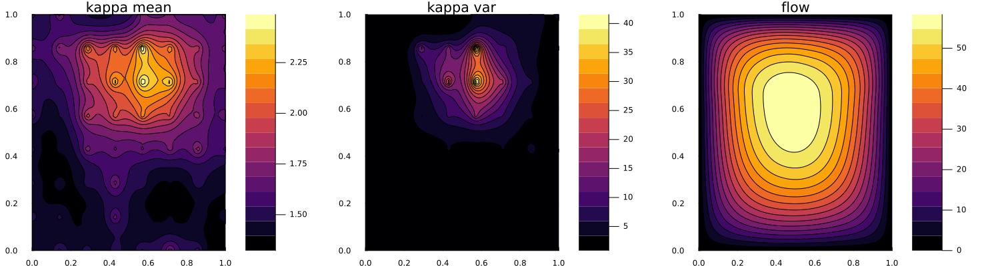
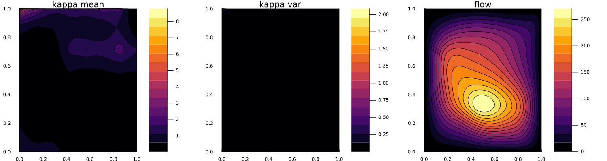
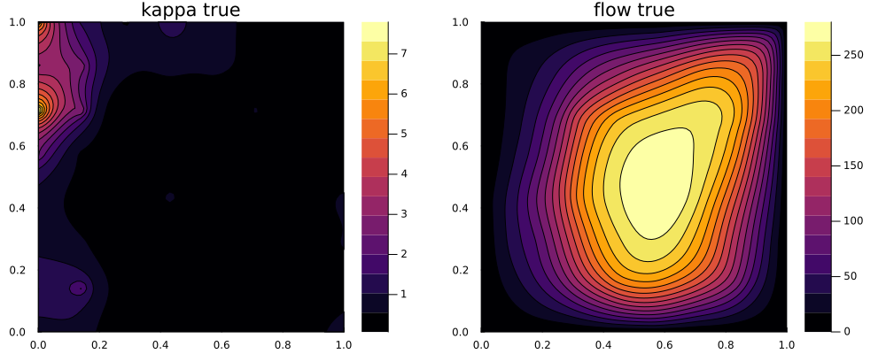

# Learning the permeability field in a Darcy flow

In this example, we illustrate a simple function learning problem.
We are presented with an unknown field that is discretized with a finite-dimensional approximation (e.g. spatial discretization).
When learning this field, if one represents each pointwise value at a gridpoint as a parameter, increasing the spatial resolution leads to increasingly high dimensional learning problems, thus giving poor computational scaling and increasingly ill-posed inverse problems from fixed data.
If instead, we treat the approximation as a discretized function living in a function space, then one can learn coefficients of a basis of this function space.
Since it is commonly the case that functions have relatively low effective dimension in this space, the dependence on the spatial discretization only arises in discretization error, which vanishes as resolution is increased.

We will solve for an unknown permeability field ``\kappa`` governing the pressure field of a [Darcy flow](https://en.wikipedia.org/wiki/Darcy%27s_law) on a square 2D domain. To learn about the permeability we shall take few pointwise measurements of the solved pressure field within the domain. The forward solver is a simple finite difference scheme taken and modified from code [here](https://github.com/Zhengyu-Huang/InverseProblems.jl/blob/master/Fluid/Darcy-2D.jl).

## Walkthrough of the code

First we load standard packages,

```julia
using LinearAlgebra
using Distributions
using Random
using JLD2
```

the package to define the function distributions,

```julia
import GaussianRandomFields # we wrap this so we don't want to use "using"
const GRF = GaussianRandomFields
```

and finally the EKP packages.

```julia
using EnsembleKalmanProcesses
using EnsembleKalmanProcesses.ParameterDistributions
const EKP = EnsembleKalmanProcesses
```

We include the forward solver here.

```julia
include("GModel.jl")
```

We define the spatial domain and discretization,

```julia
rng = Random.MersenneTwister(seed)
dim = 2
N, L = 80, 1.0
pts_per_dim = LinRange(0, L, N)
```

To provide a simple test case, we assume that the true function parameter is a particular sample from the function space we set up to define our prior. We choose a value of the truth that doesnt have a vanishingly small probability under the prior defined by a probability distribution over functions; taken to be a family of Gaussian Random Fields (GRF). This function distribution is characterized by a covariance function (Matern) and an appropriate representation (Karhunen-Loeve expansion). The representation is truncated to a finite number of coefficients, the degrees of freedom (`dofs`), which define the effective dimension of the learning problem that is decoupled from the spatial discretization. Larger `dofs` may be required to represent multiscale functions, but come at an increased dimension of the parameter space and therefore a typical increase in cost and difficulty of the learning problem. For more details see [`GaussianRandomFields.jl`](https://pieterjanrobbe.github.io/GaussianRandomFields.jl/stable/)

```julia
smoothness = 2.0
corr_length = 0.5
dofs = 50

grf = GRF.GaussianRandomField(
    GRF.CovarianceFunction(dim, GRF.Matern(smoothness, corr_length)),
    GRF.KarhunenLoeve(dofs),
    pts_per_dim,
    pts_per_dim,
)
```

We define a wrapper around the GRF, and as the permeability field must be positive we introduce a domain constraint into the function distribution. 

```julia
pkg = GRFJL()
distribution = GaussianRandomFieldInterface(grf, pkg) # our wrapper from EKP
domain_constraint = bounded_below(0) # make κ positive
pd = ParameterDistribution(
    Dict("distribution" => distribution, "name" => "kappa", "constraint" => domain_constraint),
) # the fully constrained parameter distribution
```

Henceforth, the GRF is interfaced in the same manner as any other parameter distribution with regards to interface. We choose the true value by setting all degrees of freedom ``u_{\mathrm{true}} = -1.5``; this choice is arbitrary, upto not having a vanishingly small mass under the prior. We then use the EKP transform function to build the corresponding instance of the ``\kappa_{\mathrm{true}}``.

```julia
u_true = -1.5 * ones(dofs,1) # the truth parameter
κ_true = transform_unconstrained_to_constrained(pd, u_true) # builds and constrains the function.
κ_true = reshape(κ_true, N, N)
```

We generate the data sample for the truth in a perfect model setting by evaluating the the model here, and observing the pressure field at a few subsampled points in each dimension (here `obs_ΔN`, samples every 10 points in each dimension, leading to a ``7 \times 7`` observation grid), and we assume 5% additive observational noise on the measurements.

```julia
obs_ΔN = 10 
darcy = Setup_Param(pts_per_dim, obs_ΔN, κ_true) 
h_2d = solve_Darcy_2D(darcy, κ_true)
y_noiseless = compute_obs(darcy, h_2d)
obs_noise_cov = 0.05^2 * I(length(y_noiseless)) * (maximum(y_noiseless) - minimum(y_noiseless))
truth_sample = vec(y_noiseless + rand(rng, MvNormal(zeros(length(y_noiseless)), obs_noise_cov)))
```

Now we set up the Bayesian inversion algorithm. The prior we have already defined to construct our truth

```julia
prior = pd
```

We define some algorithm parameters, here we take ensemble members larger than the dimension of the parameter space to ensure a full rank ensemble covariance.

```julia
N_ens = dofs + 2 # number of ensemble members
N_iter = 20 # number of EKI iterations
```

We sample the initial ensemble from the prior, and create the EKP object as an EKI algorithm using the `Inversion()` keyword, we also use the `DataMisfitController()` learning rate scheduler

```julia
initial_params = construct_initial_ensemble(rng, prior, N_ens) 
ekiobj = EKP.EnsembleKalmanProcess(initial_params, truth_sample, obs_noise_cov, Inversion(), scheduler=DataMisfitController())
```

We perform the inversion loop. Remember that within calls to `get_ϕ_final` the EKP transformations are applied, thus the ensemble that is returned will be the positively-bounded permeability field evaluated at all the discretization points. Each ensemble member is stored as a column and therefore for uses such as plotting one needs to reshape to the desired dimension.

```julia
err = zeros(N_iter)
for i in 1:N_iter
    params_i = get_ϕ_final(prior, ekiobj)
    g_ens = run_G_ensemble(darcy, params_i)
    EKP.update_ensemble!(ekiobj, g_ens)
end
```

## Inversion results

We plot first the prior ensemble mean and pointwise variance of the permeability field, and also the pressure field solved with the ensemble mean. 



Now we plot the final ensemble mean and pointwise variance of the permeability field, and also the pressure field solved with the ensemble mean.



We can compare this with the true permeability and pressure field:




