# EnsembleKalmanProcesses

`EnsembleKalmanProcesses.jl` (EKP) is a library of derivative-free Bayesian optimization techniques based on ensemble Kalman Filters, a well known family of approximate filters used for data assimilation. The tools in this library enable fitting parameters found in expensive black-box computer codes without the need for adjoints or derivatives. This property makes them particularly useful when calibrating non-deterministic models, or when the training data are noisy.

Currently, the following processes are implemented in the library:
 - `Inversion()` creates Ensemble Kalman Inversion (EKI) "finite time" - The traditional optimization technique based on the (perturbed-observation-based) Ensemble Kalman Filter EnKF ([Iglesias, Law, Stuart, 2013](http://dx.doi.org/10.1088/0266-5611/29/4/045001)). This takes a transport view, initializing ensembles at the prior, and the posterior mode and (roughty-approximated) uncertainty) are estimated at finite algorithm time.
 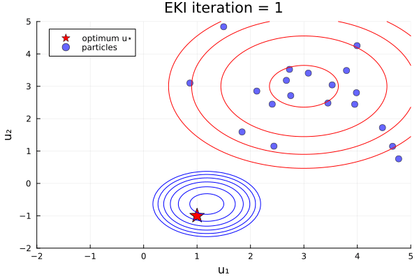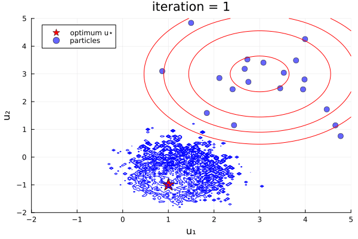
 - `Inversion(prior)` creates Ensemble Kalman Inversion (EKI) "infinite time" - EKI with an augmented state that enforces the prior, (e.g., TEKI [Chada, Stuart, Tong](https://doi.org/10.1137/19M1242331)). Can be initialized off-the-prior, and ensemble collapses to the posterior mode at infinite algorithm time (e.g., Section 4.5 of [Calvello, Reich, Stuart](https://arxiv.org/pdf/2209.11371)).
 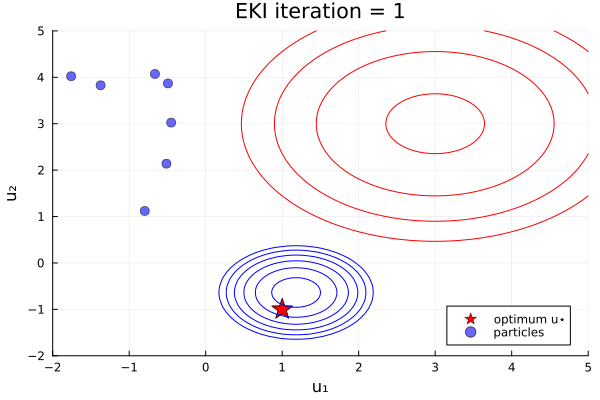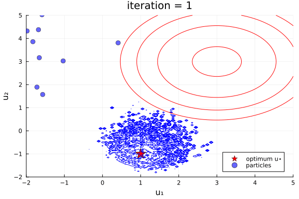
 - `TransformInversion()` Ensemble Transform Kalman Inversion (ETKI) "finite time" - An optimization technique based on the (square-root-based) ensemble transform Kalman filter  ([Bishop et al., 2001](http://doi.org/10.1175/1520-0493(2001)129<0420:ASWTET>2.0.CO;2), [Huang et al., 2022](http://doi.org/10.1088/1361-6420/ac99fa)).
 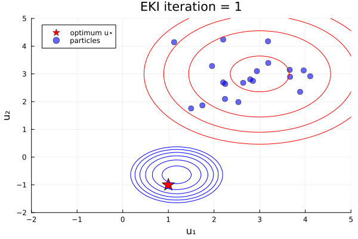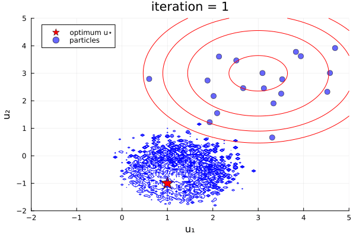
 - `TransformInversion(prior)` Ensemble Transform Kalman Inversion (ETKI) "infinite time
" - ETKI with an augmented state that enforces the prior. (see EKI "infinite time")
 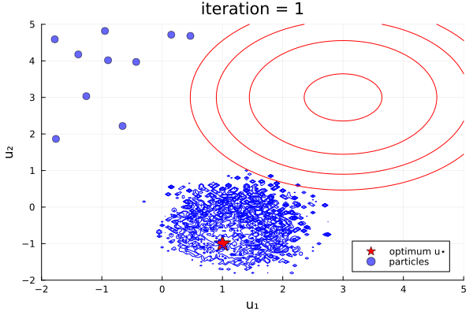
 - `GaussNewtonInversion(prior)`Gauss Newton Kalman Inversion (GNKI) [a.k.a. Iterative Ensemble Kalman Filter with Satistical Linearization] - An optimization technique based on the Gauss Newton optimization update and the iterative extended Kalman filter ([Chada et al., 2021](https://doi.org/10.48550/arXiv.2010.13299), [Chen & Oliver, 2013](https://doi.org/10.1007/s10596-013-9351-5)),
 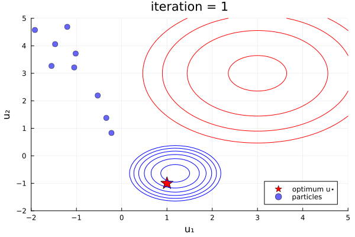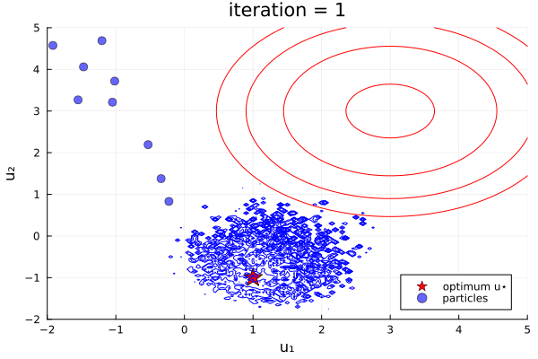 
 - `Sampler(prior)` Ensemble Kalman Sampler (EKS) - also obtains a Gaussian Approximation of the posterior distribution, through a Monte Carlo integration ([Garbuno-Inigo, Hoffmann, Li, Stuart, 2020](https://doi.org/10.1137/19M1251655)),
  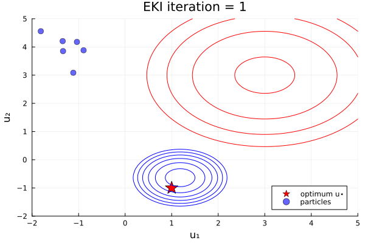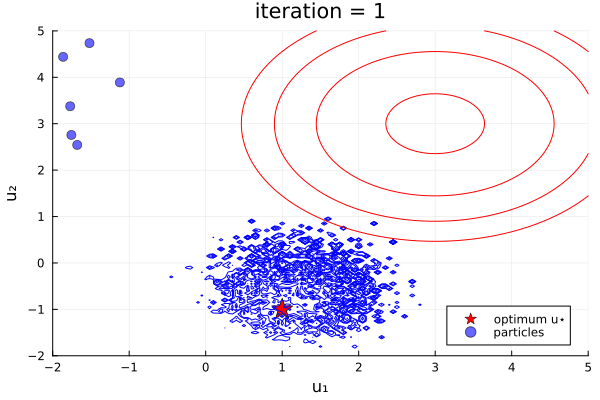
 - `Unscented(prior)` Unscented Kalman Inversion (UKI) - also obtains a Gaussian Approximation of the posterior distribution, through a quadrature based integration approach ([Huang, Schneider, Stuart, 2022](https://doi.org/10.1016/j.jcp.2022.111262)),
  
 - `TransformUnscented(prior)` Unscented Kalman Inversion (UKI) - An implementation of the UKI algorithm based on the linear-algebra tricks of the square-root filter (see ETKI).
  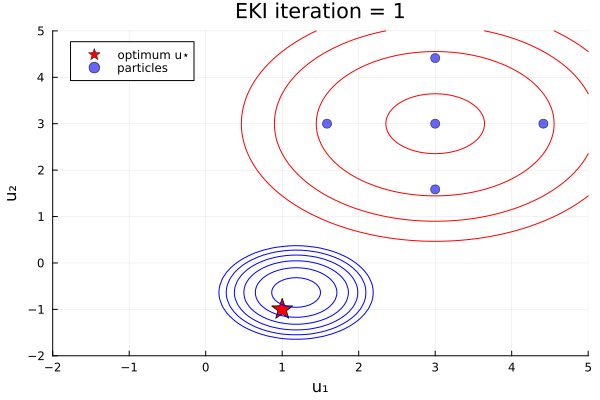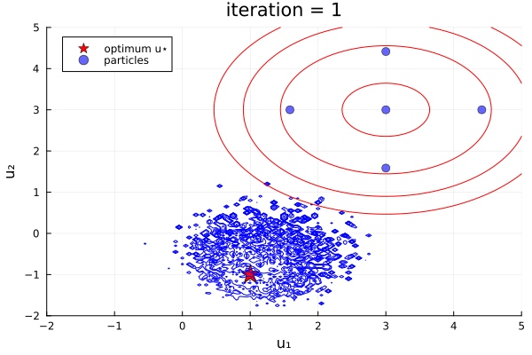
- `SparseInversion(prior)` Sparsity-inducing Ensemble Kalman Inversion (SEKI) - Additionally adds approximate ``L^0`` and ``L^1`` penalization to the EKI ([Schneider, Stuart, Wu, 2020](https://doi.org/10.48550/arXiv.2007.06175)).

Module                                      | Purpose
--------------------------------------------|--------------------------------------------------------
EnsembleKalmanProcesses.jl                  | Collection of all tools
EnsembleKalmanProcess.jl                    | Implementations of EKI, ETKI, EKS, UKI, and SEKI 
Observations.jl                             | Structure to hold observational data and minibatching
ParameterDistributions.jl                   | Structures to hold prior and posterior distributions
DataContainers.jl                           | Structure to hold model parameters and outputs
Localizers.jl                               | Covariance localization kernels

# Quick links!

- [How do I build prior distributions?](@ref parameter-distributions)
- [How do I build my observations and encode batching?](@ref observations)
- [What ensemble size should I take? Which process should I use? What is the recommended configuration?](@ref defaults)
- [What is the difference between `get_u` and `get_ϕ`? Why do the stored parameters apperar to be outside their bounds?](@ref parameter-distributions)
- [What can be parallelized? How do I do it in Julia?](@ref parallel-hpc)
- [What is going on in my own code?](@ref troubleshooting)
- [What is this error/warning/message?](@ref troubleshooting)
- Where can i walk through a simple example?
Learning the amplitude and vertical shift of a sine curve
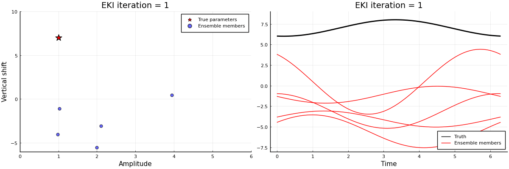
[See full example for the code.](literated/sinusoid_example.md)

## Authors

`EnsembleKalmanProcesses.jl` is being developed by the [Climate Modeling
Alliance](https://clima.caltech.edu). The main developers are Oliver R. A. Dunbar and Ignacio Lopez-Gomez.

