# EnsembleKalmanProcesses

`EnsembleKalmanProcesses.jl` (EKP) is a library of derivative-free optimization and approximate Bayesian inference techniques based on ensemble Kalman Filters, a well known family of approximate filters used for data assimilation. The tools in this library enable fitting parameters found in expensive black-box computer codes without the need for adjoints or derivatives. This property makes them particularly useful when calibrating non-deterministic models, or when the training data are noisy.

See [Installation](@ref) to get started.

## Our processes and quick recommendations

Here are loose recommendations and rough scalability in the current implementations
- **Playground option: [`Inversion`](@ref eki)** (``10^3`` inputs, ``10^3`` outputs) - simple, handles large input spaces, and is very modifiable with all the bells-and-whistles of the package. 
- **Efficient option: [`TransformUnscented`](@ref utki)** (``10^1`` inputs, ``10^7`` outputs) - Very efficient, and quickly converging for large outputs. However, it strongly couples ensemble size to input dimension, and is not as robust to model failures and noise.
- **Scalable and Robust option: [`TransformInversion`](@ref etki)** (``10^2`` inputs, ``10^7`` outputs) - Less efficient convergence than `TransformUnscented`, but only weakly couples ensemble size with input dimension, and more robust to model failures and noise. 
- **With uncertainty: [`Sampler`](@ref eks)** (``10^2`` inputs, ``10^3`` outputs) - generally slower to converge than inversion tools, but the final ensemble spread quantifies uncertainty.

## Quick links!

- [How do I build prior distributions?](@ref parameter-distributions)
- [How do I access parameters/outputs from the ekp object?](@ref get-results)
- [How do I plot convergence errors or parameter distributions?](@ref visualization)
- [How do I build good observational noise covariances?](@ref building-covariances)
- [How do I build my observations and encode batching?](@ref observations)
- [What ensemble size should I take? Which process should I use? What is the recommended configuration?](@ref defaults)
- [What is the difference between `get_u` and `get_ϕ`? Why do the stored parameters appear to be outside their bounds?](@ref parameter-distributions)
- [What can be parallelized? How do I do it in Julia?](@ref parallel-hpc)
- [What is going on in my own code?](@ref troubleshooting)
- [What is this error/warning/message?](@ref troubleshooting)
- Where can I walk through a simple example?
Learning the amplitude and vertical shift of a sine curve
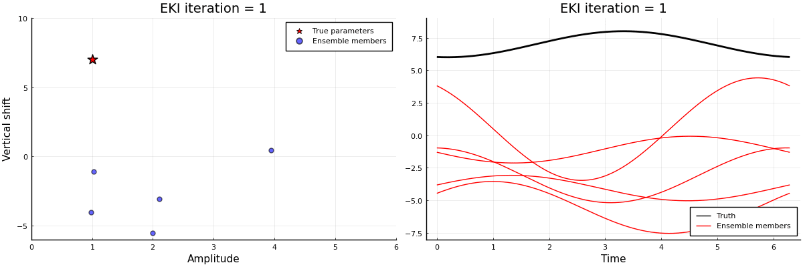
[See full example for the code.](literated/sinusoid_example.md)


## The library

Currently, the following processes are implemented in the library. More details given on respective pages:
 - [`Inversion()`](@ref eki) creates Ensemble Kalman Inversion (EKI) "finite time" - The traditional optimization technique based on the (perturbed-observation-based) Ensemble Kalman Filter EnKF [Iglesias13a](@citep). This takes a transport view, initializing ensembles at the prior, and the posterior mode and (roughly approximated) uncertainty are estimated at finite algorithm time.
```@raw html
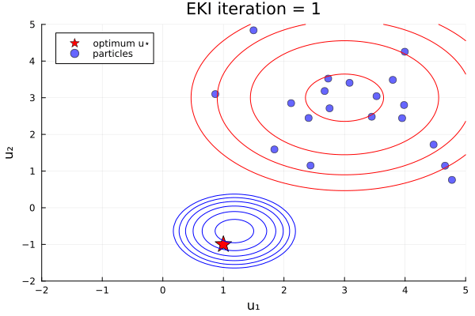 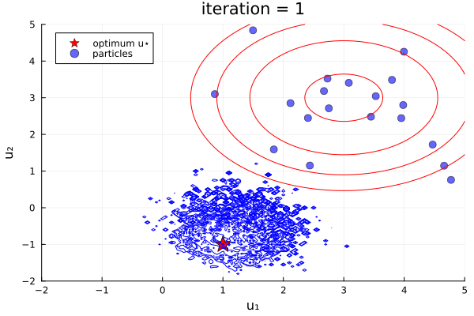
```
 - [`Inversion(prior)`](@ref finite-vs-infinite-time) creates Ensemble Kalman Inversion (EKI) "infinite time" - EKI with an augmented state that enforces the prior, (e.g., TEKI [Chada20x](@citep)). Can be initialized off-the-prior, and ensemble collapses to the posterior mode at infinite algorithm time (e.g., Section 4.5 of [Calvello25a](@cite)).
```@raw html
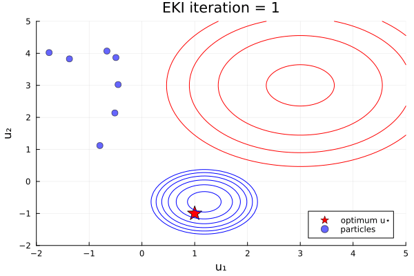 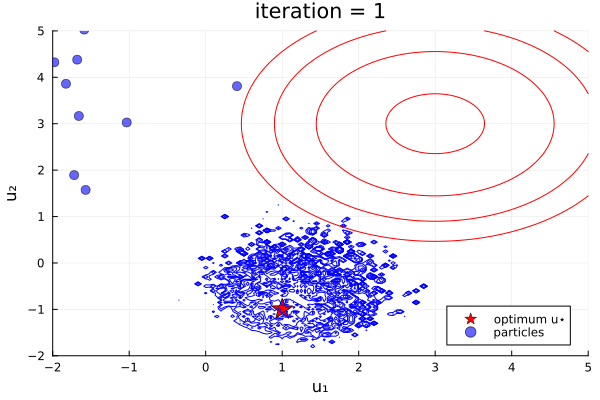
```
 - [`TransformInversion()`](@ref etki) Ensemble Transform Kalman Inversion (ETKI) "finite time" - An optimization technique based on the (square-root-based) ensemble transform Kalman filter [Bishop01a, Huang22b](@citep).
```@raw html
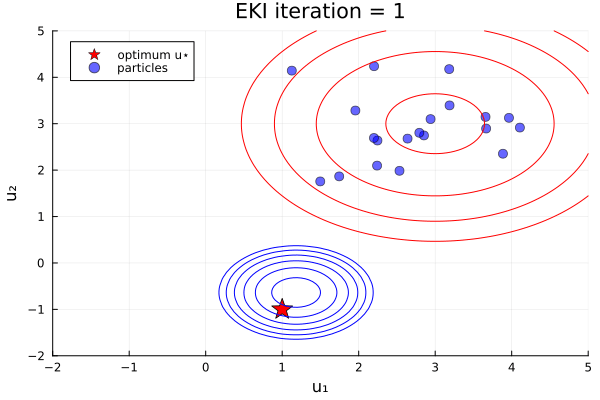 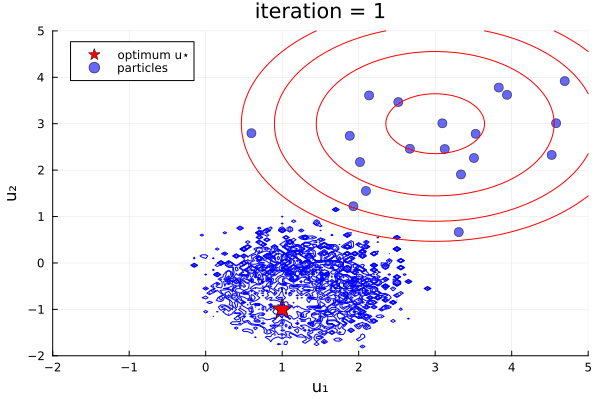
```
- [`TransformInversion(prior)`](@ref finite-vs-infinite-time) Ensemble Transform Kalman Inversion (ETKI) "infinite time" - ETKI with an augmented state that enforces the prior. (see EKI "infinite time")
```@raw html
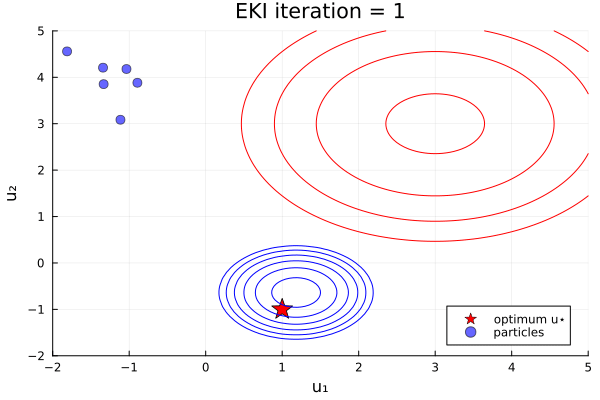 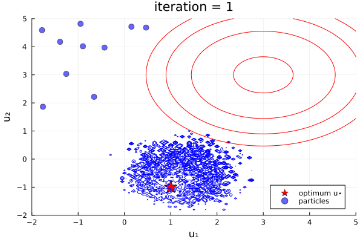
```
 - [`GaussNewtonInversion(prior)`](@ref gnki) Gauss Newton Kalman Inversion (GNKI) [a.k.a. Iterative Ensemble Kalman Filter with Statistical Linearization] - An optimization technique based on the Gauss Newton optimization update and the iterative extended Kalman filter [Chada21a, Chen13c](@citep),
```@raw html
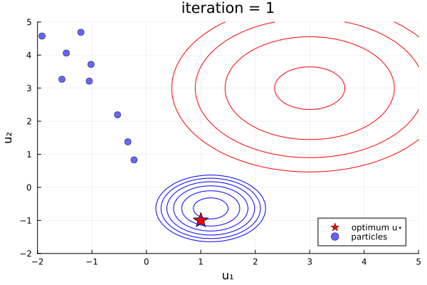 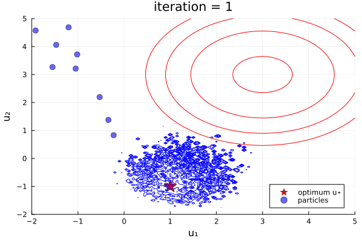
```
 - [`Sampler(prior)`](@ref eks) Ensemble Kalman Sampler (EKS) - also obtains a Gaussian Approximation of the posterior distribution, through a Monte Carlo integration [Garbuno-Inigo20b](@citep), ("ALDI" variant)
```@raw html
 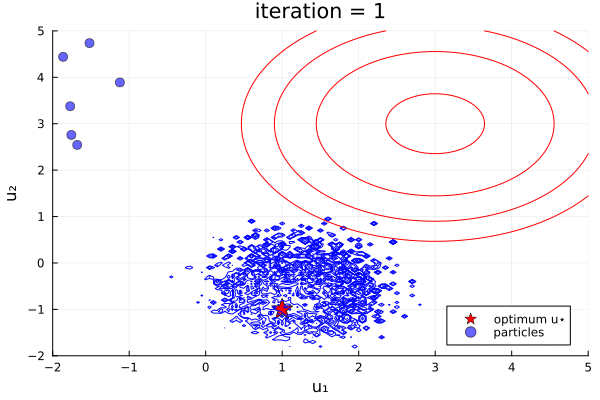
```
 - [`Unscented(prior)`](@ref uki) Unscented Kalman Inversion (UKI) - also obtains a Gaussian Approximation of the posterior distribution, through a quadrature based integration approach [Huang22a](@citep),
```@raw html
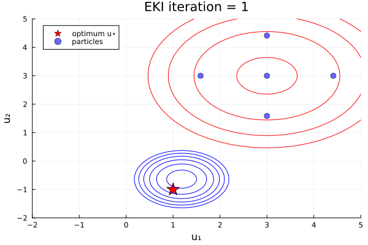 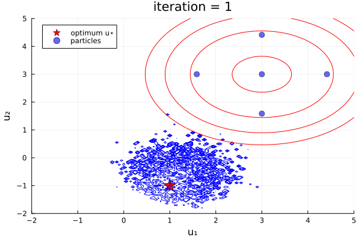
```
 - [`TransformUnscented(prior)`](@ref utki) Transform Unscented Kalman Inversion (UTKI) - An implementation of the UKI algorithm based on the linear-algebra tricks of the square-root filter (see ETKI).
```@raw html
 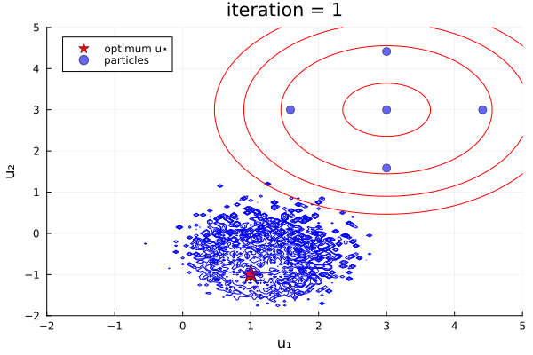
```
- [`SparseInversion(γ)`](@ref seki) Sparsity-inducing Ensemble Kalman Inversion (SEKI) - Additionally adds approximate ``L^0`` and ``L^1`` penalization to the EKI [Schneider22v](@citep).


Module                                      | Purpose
--------------------------------------------|--------------------------------------------------------
EnsembleKalmanProcesses.jl                  | Collection of all tools
EnsembleKalmanProcess.jl                    | Implementations of EKI, ETKI, EKS, UKI, UTKI, GNKI, and SEKI
Observations.jl                             | Structure to hold observational data and minibatching
ParameterDistributions.jl                   | Structures to hold prior and posterior distributions
DataContainers.jl                           | Structure to hold model parameters and outputs
Localizers.jl                               | Covariance localization kernels
Accelerators.jl                             | Ensemble accelerators (e.g., Nesterov) for faster convergence
LearningRateSchedulers.jl                   | Adaptive timestepping and termination criteria
TOMLInterface.jl                            | File-based interface for parameters stored in TOML format
UpdateGroup.jl                              | Structure to partition parameter-observation pairs for blocked updates
Visualize.jl (via Makie extension)          | Plotting utilities for priors, ensembles, and error metrics

## Authors

`EnsembleKalmanProcesses.jl` is being developed by the [Climate Modeling
Alliance](https://clima.caltech.edu). See the [contributors page](https://github.com/CliMA/EnsembleKalmanProcesses.jl/graphs/contributors) for the developers.

