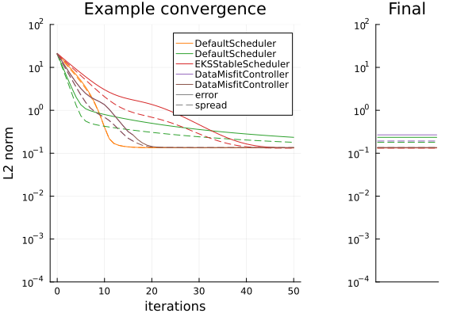

# [Learning Rate Schedulers (a.k.a) Timestepping](@id learning-rate-schedulers)

## Overview

We demonstrate the behaviour of different learning rate schedulers through solution of a nonlinear inverse problem.

In this example we have a model that produces the exponential of a sinusoid ``f(A, v) = \exp(A \sin(t) + v), \forall t \in [0,2\pi]``. Given an initial guess of the parameters as ``A^* \sim \mathcal{N}(2,1)`` and ``v^* \sim \mathcal{N}(0,25)``, the inverse problem is to estimate the parameters from a noisy observation of only the maximum and mean value of the true model output.

We shall compare the following configurations of implemented schedulers. 
1. Fixed, "long" timestep `DefaultScheduler(0.5)` - orange
2. Fixed, "short" timestep `DefaultScheduler(0.02)` - green
3. Adaptive timestep (designed originally to ensure EKS remains stable) `EKSStableScheduler()` [Kovachki & Stuart 2018](https://doi.org/10.1088/1361-6420/ab1c3a) - red
4. Misfit controlling timestep (Terminating) `DataMisfitController()` [Iglesias & Yang 2021](https://doi.org/10.1088/1361-6420/abd29b) - purple
5. Misfit controlling timestep (Continuing beyond Terminate condition) `DataMisfitController(on_terminate="continue")` - brown

!!! info "Recommended Scheduler"
    For typical problems [we provide a default scheduler](@ref defaults) depending on the process. For example, when constructing an `Inversion()`-type `EnsembleKalmanProcess`, by default this effectively adds the scheduler
    ```julia
scheduler = DataMisfitController(terminate_at = 1) # adaptive step-sizestop at algorithm time "T=1"
    ```

To modify the scheduler, use the keyword argument
```julia
ekpobj = EKP.EnsembleKalmanProcess(args...; scheduler = scheduler, kwargs...)
```
Several choices are available:
```julia
scheduler = MutableScheduler(2) # modifiable stepsize
scheduler = EKSStableScheduler(numerator=10.0, nugget = 0.01) # Stable for EKS
scheduler = DataMisfitController(terminate_at = 1000) # stop at algorithm time "T=1"
```
Please see the [learning rate schedulers API](@ref scheduler_api) for defaults and other details

## Early termination (adaptive step-sizes)

Early termination can be implemented in the calibration loop as 
```julia
using EnsembleKalmanProcesses # for get_ϕ_final, update_ensemble!
# given
# * the number of iterations `N_iter`
# * a prior `prior`
# * a forward map `G`
# * the EKP object `ekpobj`

for i in 1:N_iter
    params_i = get_ϕ_final(prior, ekpobj)
    g_ens = G(params_i)
    terminated = update_ensemble!(ekpobj, g_ens) # check for termination
    if !isnothing(terminated) # if termination is flagged, break the loop
       break
    end
end 
```
The final iteration may be less than `N_iter`.

## Timestep and termination time

Recall, for example for EKI, we perform updates of our ensemble of parameters ``j=1,\dots,J`` at step ``n = 1,\dots,N_\mathrm{it}`` using

`` \theta_{n+1}^{(j)} = \theta_{n}^{(j)} - \dfrac{\Delta t_n}{J}\sum_{k=1}^J \left \langle \mathcal{G}(\theta_n^{(k)}) - \bar{\mathcal{G}}_n \, , \, \Gamma_y^{-1} \left ( \mathcal{G}(\theta_n^{(j)}) - y \right ) \right \rangle \theta_{n}^{(k)},``

where ``\bar{\mathcal{G}}_n`` is the mean value of ``\mathcal{G}(\theta_n)``
across ensemble members. We denote the current time ``t_n = \sum_{i=1}^n\Delta t_i``, and the termination time as ``T = t_{N_\mathrm{it}}``.

!!! note 
    Adaptive Schedulers typically try to make the biggest update that controls some measure of this update. For example, `EKSStableScheduler()` controls the frobenius norm of the update, while `DataMisfitController()` controls the Jeffrey divergence between the two steps. Largely they follow a pattern of scheduling very small initial timesteps, leading to much larger steps at later times.

There are two termination times that the theory indicates are useful
- ``T=1``: In the linear Gaussian case, the ``\{\theta_{N_\mathrm{it}}\}`` will represent the posterior distribution. In nonlinear case it should still provide an approximation to the posterior distribution. Note that as the posterior does not necessarily optimize the data-misfit we find ``\bar{\theta}_{N_\mathrm{it}}`` (the ensemble mean) provides a conservative estimate of the true parameters, while retaining spread. It is noted in [Iglesias & Yang 2021](https://doi.org/10.1088/1361-6420/abd29b) that with small enough (or well chosen) step-sizes this estimate at ``T=1`` satisfies a discrepancy principle with respect to the observational noise.
- ``T\to \infty``: Though theoretical concerns have been made with respect to continuation beyond ``T=1`` for inversion methods such as EKI, in practice we commonly see better optimization of the data-misfit, and thus better representation ``\bar{\theta}_{N_\mathrm{it}}`` to the true parameters. As expected this procedure leads to ensemble collapse, and so no meaningful information can be taken from the posterior spread, and the optimizer is not likely to be the posterior mode.


## The experiment with EKI & UKI

We assess the schedulers by solving the inverse problem with EKI and UKI (we average results over 100 initial ensembles in the case of EKI). We will not draw comparisons between EKI and UKI here, rather we use them to observe consistent behavior in the schedulers. Shown below are the solution plots of one solve with each timestepper, for both methods. 

 

*Top: EKI, Bottom: UKI. Left: The true model over ``[0,2\pi]`` (black), and solution schedulers (colors).
Right: The noisy observation (black) of mean and max of the model; the distribution it was sampled from (gray-ribbon), and the corresponding ensemble-mean approximation given from each scheduler (colors).*

To assess the timestepping we show the convergence plot against the algorithm iteration we measure two quantities.
- error (solid) is defined by ``\frac{1}{N_{ens}}\sum^{N_{ens}}_{i=1} \| \theta_i - \theta^* \|^2`` where ``\theta_i`` are ensemble members and ``\theta^*`` is the true value used to create the observed data.
- spread (dashed) is defined by ``\frac{1}{N_{ens}}\sum^{N_{ens}}_{i=1} \| \theta_i - \bar{\theta} \|^2`` where ``\theta_i`` are ensemble members and ``\bar{\theta}`` is the mean over these members.

 

*Top: EKI. Bottom: UKI. Left: the error and spread of the different timesteppers at over iterations of the algorithm for a single run.
Right: the error and spread of the different timesteppers at their final iterations, (for EKI, averaged from 100 initial conditions).*

Finding the Posterior (terminating at ``T=1``):
 - DMC with termination (purple), closely mimics a small-fixed timestep (green) that finishes stepping at ``T=1``. Both retain more spread than other approaches, and DMC is far more efficient, typically terminating after around 10-20 steps, where fixed-stepping takes 50. We see that (for this experiment) this is a conservative estimate, as continuing to solve (e.g. brown) until later times often leads to a better error while still retaining similar "error vs spread" curves (before inevitable collapse). This is consistent with the concept of approximating the posterior, over seeking an optimizer.
- The behavior observed in UKI is similar to EKI

Optimizing the objective function (continuing ``T \to \infty``):
- Large fixed step (orange). This is very efficient, but can get stuck when drawn too large, (perhaps unintuitive from a gradient-descent perspective). It typically also collapses the ensemble. On average it gives lower error to the true parameters than DMC. 
 - Both EKSStable and DMC with continuation schedulers, perform very similarly. Both retain good ensemble spread during convergence, and collapse after finding a local optimum. This optimum on average has the best error to the true parameters in this experiment. They appear to consistently find the same optimum as ``T\to\infty`` but DMC finds this in fewer iterations.
- The UKI behavior is largely similar to EKI here, except that ensemble spread is retained in the ``T\to\infty`` limit in all cases, from inflation of the parameter covariance (``\Sigma_\omega``) within our implementation.


!!! warning "EnsembleKalmanSampler"
    We observe blow-up in EKS, when not using the `EKSStableScheduler`.