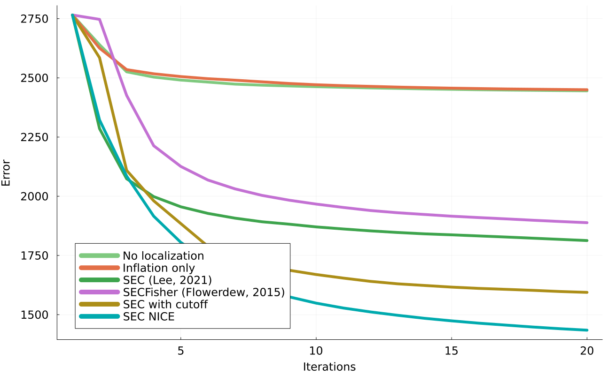

# [Localization and Sampling Error Correction (SEC)](@id localization)

Ensemble Kalman inversion (EKI) seeks to find an optimal parameter vector ``\theta \in \mathbb{R}^p`` by minimizing the mismatch between some data ``y \in \mathbb{R}^d`` and the forward model output ``\mathcal{G}(\theta) \in \mathbb{R}^d``. Instead of relying on derivatives of the map ``\mathcal{G}`` with respect to ``\theta`` to find the optimum, EKI leverages sample covariances ``\mathrm{Cov}(\theta, \mathcal{G})`` and  ``\mathrm{Cov}(\mathcal{G}, \mathcal{G})`` diagnosed from an ensemble of ``J`` particles,

```math
   \tag{1}
   \begin{aligned}
         &\mathrm{Cov}(\theta, \mathcal{G}) = \dfrac{1}{J}\sum_{j=1}^{J}
        ({\theta}^{(j)} - {m})(\mathcal{G}(\theta^{(j)}) - \bar{\mathcal{G}})^T, \\

        &\mathrm{Cov}(\mathcal{G}, \mathcal{G}) = \dfrac{1}{J}\sum_{j=1}^{J}
        (\mathcal{G}(\theta^{(j)}) - \bar{\mathcal{G}})(\mathcal{G}(\theta^{(j)}) - \bar{\mathcal{G}})^T, \\
    \end{aligned}
```
where ``{m}`` and ``\bar{\mathcal{G}}`` are the ensemble averages of ``\theta`` and ``\mathcal{G}(\theta)``, respectively.

For models with just a few (``p``) parameters, we can typically afford to use ``J > p`` ensemble members, such that the sample covariance  ``\mathrm{Cov}(\theta, \mathcal{G})`` is full rank. Using more ensemble members than the number of model parameters, EKI can in theory probe all dimensions of parameter space to find the optimum parameter vector.

For models with a lot of parameters (e.g., a deep neural network), computational constraints limit the size of the ensemble to ``J < p`` or even ``J \ll p`` members. Due to the characteristics of the EKI update equation, this means that the method can only find the minimum in the ``(J-1)``-dimensional space spanned by the initial ensemble, leaving ``p-J+1`` dimensions unexplored. This is known as the subspace property of EKI. As the dimensional gap ``p-J`` increases, we can expect the solution of the algorithm to deteriorate.

## Enter Localization

In algebraic terms, the extent to which we can explore the dimensions of parameter space is roughly given by the rank of the matrices in equation (1). In the case ``J < p``, the rank of ``\mathrm{Cov}(\theta, \mathcal{G})`` is limited to ``\mathrm{min}(d, J-1)``. It has been shown that the performance of ensemble Kalman methods with ``J < p`` can be greatly improved by boosting this rank through an elementwise product with a suitable localization kernel ``\Lambda``,

```math
\tag{2} \mathrm{rank}(\mathrm{Cov}(\theta, \mathcal{G}) \odot \Lambda) \geq \mathrm{rank}(\mathrm{Cov}(\theta, \mathcal{G})).
```

Substituting the covariance ``\mathrm{Cov}(\theta, \mathcal{G})`` by the boosted version defined in the left-hand side of equation (2), EKI is able to break the subspace property and explore additional dimensions in parameter space. Localization is an empirical way of correcting for the sampling error due to a small ensemble size, and so it can also be interpreted as a sampling error correction (SEC) method.

## Localization in EnsembleKalmanProcesses

A wide variety of localization kernels are available in `EnsembleKalmanProcesses.jl` under the module `Localizers`. The *optimal* localization kernel will depend on the structure of the problem at hand, so the user is encouraged to try different kernels and review their references in the literature.

In practice, the localization method is chosen at `EnsembleKalmanProcess` construction time,

```julia
using Distributions
using LinearAlgebra
using EnsembleKalmanProcesses
using EnsembleKalmanProcesses.ParameterDistributions
using EnsembleKalmanProcesses.Localizers
const EKP = EnsembleKalmanProcesses

p = 10; d = 20; J = 6

# Construct initial ensemble
priors = ParameterDistribution[]
for i in 1:p
   push!(priors, ParameterDistribution(Parameterized(Normal(0.0, 0.5)), no_constraint(), string("u", i)))
end
prior = combine_distributions(priors)
initial_ensemble = EKP.construct_initial_ensemble(prior, J)

y = 10.0 * rand(d)
Γ = 1.0 * I

# Construct EKP object with localization. Some examples of localization methods:
locs = [Delta(), RBF(1.0), RBF(0.1), BernoulliDropout(0.1), SEC(10.0), SECFisher(), SEC(1.0, 0.1), SECNice()]
for loc in locs
   ekiobj = EKP.EnsembleKalmanProcess(initial_ensemble, y, Γ, Inversion(); localization_method = loc)
end
```
!!! note
    Currently Localization and SEC are implemented only for the `Inversion()` process, we are working on extensions to `TransformInversion()` 

## The following example is found in `examples/Localization/localization_example_lorenz96.jl`
This example was originally taken from [Tong and Morzfeld (2022)](https://doi.org/10.48550/arXiv.2201.10821). Here, a single-scale lorenz 96 system state of dimension 200 is configured to be in a chaotic parameter regime, and integrated forward with timestep ``\Delta t`` until time ``T``. The goal is to perform ensemble inversion for the state at time ``T-20\Delta t``, given a noisy observation of the state at time ``T``.

To perform this state estimation we use ensemble inversion with ensembles of size 20. This problem is severely ill-posed, and we make up for this by imposing sample-error correction methods to our state. Note that the SEC methods do not assume any spatial structure in the state, (differing from traditional state localization) and so are well suited for other types of inversions over parameter space.



!!! note "Our recommendation"
    Based on these results, our recommendation is to use the `SECNice()` approach for the `Inversion()` process. Not only does it perform well, but additionally  it requires no tuning parameters, unlike for example `SEC()`.

